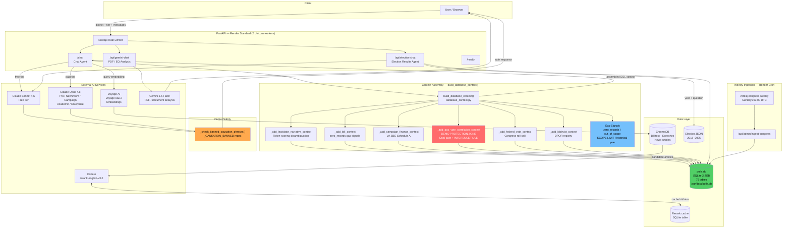

# VoteIQ — System Architecture

> Civic intelligence platform for Virginia voters, journalists, and campaigns. Surfaces 25 years of roll-call votes, campaign finance, PAC spending, and lobbyist activity with full source provenance — built so that every claim is traceable to a public record.

---

## Table of Contents

1. [System Overview](#1-system-overview)
2. [Five Core Components](#2-five-core-components)
3. [Data Layer](#3-data-layer)
4. [SQL-First Retrieval Architecture](#4-sql-first-retrieval-architecture)
5. [PAC-Vote Correlation Layer](#5-pac-vote-correlation-layer)
6. [Full Tech Stack](#6-full-tech-stack)
7. [Deployment](#7-deployment)
8. [Data Assets](#8-data-assets)
9. [Design Decisions & Tradeoffs](#9-design-decisions--tradeoffs)
10. [System Architecture Diagram](#10-system-architecture-diagram)

---

## 1. System Overview

VoteIQ is a production AI platform that lets voters, journalists, and civic researchers ask natural-language questions about Virginia government — and get answers backed by verifiable public records, not language-model inference.

**Who uses it:**
- Voters who want to know who represents them and how their legislators actually vote
- Journalists investigating donor-vote alignment, PAC spending, and lobbyist activity
- Campaigns tracking opponent voting records and funding patterns
- Civic researchers needing structured access to 25 years of legislative data

**What it does that an LLM alone cannot:**
Every answer is grounded in a SQL context block assembled from the live database before the LLM is invoked. The model is given verified rows with source URLs — it synthesizes prose, not data. If the database has no record for a query, the system explicitly declines rather than inferring an answer.

**Production URL:** deployed on Render at a persistent `/var/data/polls.db` volume (2.2 GB SQLite, 76 tables).

---

## 2. Five Core Components

### Component 1 — Chat Agent (`/chat`)

The primary conversational interface. Handles all Virginia state legislative, campaign finance, lobbyist, and federal delegation queries.

**Request routing:**
- Incoming payload carries `district`, `hod_district`, `sd_district`, `tier`, and `session_type`
- District fields resolve which legislators are "local" for the querying voter
- `tier` determines model: `free` → Claude Sonnet 4.6; `pro / newsroom / campaign / academic / enterprise` → Claude Opus 4.8
- `session_type=research` sets a 1-hour Anthropic prompt-cache TTL (used for WHRO demo warmup)

**Context assembly sequence:**
1. `build_database_context()` runs first — assembles SQL context blocks
2. Voyage AI embedding of the query against ChromaDB (bill text, speeches, news) — supplemental RAG
3. Cohere reranking of news article candidates (if news retrieval is triggered)
4. Full context + system prompt → LLM
5. `_check_banned_causation_phrases()` validates LLM output before returning

**Answer type classifier:** `_answer_type_from_context()` detects whether the assembled context is primarily votes, campaign finance, lobbyist data, or general info — and routes the system prompt accordingly.

---

### Component 2 — Gemini PDF Analysis (`/api/gemini-chat`)

A separate route using Google Gemini 2.5 Flash for document-grounded analysis. Primary use case: Virginia executive orders uploaded as PDFs.

- Model: `gemini-2.5-flash` (via `google-genai`)
- Designed for long-form document comprehension tasks unsuitable for SQL retrieval
- Isolated from the main chat agent; does not share context or state

---

### Component 3 — Opus Deep Analysis (paid-tier routing)

When a user's `tier` field maps to a paid plan, the chat agent routes to Claude Opus 4.8 instead of Sonnet 4.6. This is not a separate service — it's the same `/chat` route with a different model selection.

Tier→model mapping in `voteiq/config/tiers.py`:
```
free       → claude-sonnet-4-6
pro        → claude-opus-4-8
newsroom   → claude-opus-4-8
campaign   → claude-opus-4-8
academic   → claude-opus-4-8
enterprise → claude-opus-4-8
```

Models are configurable via environment variables (`ANTHROPIC_MODEL`, `CLAUDE_OPUS_MODEL`) so a deployment can pin exact versions without code changes.

---

### Component 4 — Election Results Agent (`/api/election-chat`)

A lightweight dedicated chat endpoint for Virginia election results, 2018–2025.

- Context is built from structured JSON result files (one per year), not SQLite
- `_build_election_chat_context()` assembles race-level summaries, filters to the queried district or candidate, and formats margin/party data
- Falls back to statewide locality breakdowns for 2025 (Governor, LG, AG)
- Routes to Sonnet 4.6 regardless of tier (election chat is a distinct surface from the main agent)
- Deliberately separated from `/chat` because election result questions ("how did Norfolk vote in April") are structurally different from legislative queries and have their own data format

---

### Component 5 — Cohere Rerank

When news articles are retrieved as supplemental context (via keyword or semantic search), the top candidates are reranked by Cohere before injection into the LLM prompt.

- Model: `rerank-english-v3.0`
- Input: headline + summary strings for each candidate article
- Output: top-N reranked indexes
- **SQLite-backed cache:** rerank results are cached in a `cohere_rerank_cache` table (keyed by SHA-256 hash of question + candidates). Repeated similar queries hit the cache, not the Cohere API — reducing both latency and cost
- Fallback: if Cohere is unavailable, returns the top-N candidates by original order

---

## 3. Data Layer

### SQLite — `polls.db`

Single-file production database, 2.2 GB, 76 tables. Mounted at `/var/data/polls.db` on Render's persistent disk.

| Table | Rows | Contents |
|---|---|---|
| `va_cf_schedule_a` | 2,212,860 | Virginia SBE Schedule A campaign contributions |
| `va_cf_reports` | 213,942 | Campaign finance reports (committee-level) |
| `committee_testimony_proxy` | 150,904 | Committee hearing testimony records |
| `congress_floor_statements` | 110,025 | U.S. House/Senate floor statements |
| `legiscan_va_votes` | 52,657 | Virginia roll-call vote records (OpenStates/LegiScan) |
| `legislator_narratives` | 168 | Pre-generated civic profiles (one per active legislator) |
| `fec_independent_expenditures` | — | FEC Schedule E PAC/outside spending |
| `va_lobbyists` / `va_lobbyist_clients` | — | Virginia registered lobbyist registry |
| `congress_votes` | — | Federal House/Senate roll-call votes (119th Congress) |
| `va_bills` | — | Virginia bill metadata (LegiScan) |
| `donor_vote_alignment` | — | Pre-computed donor-sector vs. vote-pattern alignment scores |

Path is centralized in `config/db.py` — a single source of truth that raises a loud error if the Render disk is not mounted, preventing silent fallback to a stale local copy.

### ChromaDB — Vector Store

Stores embeddings of bill full-text, legislative speeches, and news articles. Queried via Voyage AI embeddings, reranked by Cohere, then injected as supplemental context. ChromaDB is **never authoritative** for structured facts (votes, counts, dollar amounts) — those always come from SQLite.

### Voyage AI — Embeddings

Model: `voyage-law-2` (domain-tuned for legal and legislative text). Used to embed both the user query and the ChromaDB corpus. If Voyage AI is unavailable, the system falls back gracefully: ChromaDB step is skipped and the system notes the gap in the system prompt rather than silently omitting context.

---

## 4. SQL-First Retrieval Architecture

### Philosophy

The LLM is a synthesizer, not a source. Before every chat response, `build_database_context()` in `voteiq/services/database_context.py` assembles a structured context block from verified database rows. The LLM receives:

```
[Database Context - polls federal vote lookup]
Source: Congress.gov / House Clerk roll-call tables
target_name=Jennifer A. Kiggans; bioguide_id=K000399
congress_votes summary: congress=119; total_votes=550; yea_votes=409; ...
source_url=https://clerk.house.gov/Votes/2026/0200
```

It does not receive: "Tell me what you know about Kiggans's voting record."

### Context Assembly Waterfall

`build_database_context()` runs a sequence of specialized sub-functions, each targeting a different data category. Each function is gated by keyword detection on the user query:

| Sub-function | Triggers on | Data source |
|---|---|---|
| `_add_legislator_narrative_context` | Legislator name mention | `legislator_narratives` table |
| `_add_bill_context` | Bill number (HB/SB/HR format) | `va_bills`, `legiscan_va_votes` |
| `_add_campaign_finance_context` | Finance keyword set | `va_cf_schedule_a`, `va_cf_reports` |
| `_add_pac_vote_correlation_context` | PAC signal + vote signal (dual gate) | `fec_independent_expenditures` + vote waterfall |
| `_add_governor_action_context` | Governor/executive keywords | `governor_actions` |
| `_add_federal_vote_context` | Federal/Congress keywords + legislator | `congress_votes` |
| `_add_lobbyist_context` | Lobbyist keywords | `va_lobbyists`, `va_lobbyist_clients` |

Each returned block carries provenance fields: `source_url`, `openstates_url`, `source=Virginia SBE Schedule A`. The LLM is instructed to cite these fields in its response.

### Explicit Gap Signals (Hallucination Prevention)

When a query looks answerable but the database has no matching record, the system inserts an explicit signal rather than returning empty context:

```
[Database Context - polls.va_bills HB999]
lookup_status=zero_records
detail=No record found for bill HB999 in session 2026.
This bill number does not exist in the VoteIQ dataset.
Do NOT fabricate a vote or outcome for this bill.
```

Four categories of gap signal are emitted:

| Signal type | Example trigger | Action |
|---|---|---|
| `lookup_status=zero_records` | Bill number with no DB row | Block injected at position 0 |
| `lookup_status=out_of_scope` | School board, local government | Block injected with scope explanation |
| `SCOPE LIMIT:` | Public opinion polling question | Injected before all other context |
| Historical year (pre-2000) | "1995 governor" | Injected at position 0 before truncation |

The historical-year block is inserted at index 0 specifically because `_add_governor_action_context` can return thousands of rows that fill `max_chars`, truncating any block appended at the end. Position 0 guarantees visibility.

### Name Disambiguation

`_add_legislator_narrative_context` resolves ambiguous names (e.g., "Don Scott" vs. "Phillip A. Scott") via token-scoring: it counts significant tokens (length ≥ 3, not an honorific, not an initial) from the DB name that appear in the query. The candidate with the highest score wins; on a tie, the longer full name wins. This correctly routes "Don Scott" queries to Don L. Scott Jr. instead of Phillip A. Scott without touching vote retrieval logic.

---

## 5. PAC-Vote Correlation Layer

### Architecture

`_add_pac_vote_correlation_context()` is the platform's most sensitive and carefully engineered component. It surfaces the relationship between PAC money and voting records — without asserting causation.

**Dual-gate entry condition:**  
Both gates must match before this function runs:
1. `_PAC_VOTE_PAC_SIGNAL` — query must contain PAC/outside-spending vocabulary (pac, super pac, independent expenditure, outside spending, …)
2. `_PAC_VOTE_VOTE_SIGNAL` — query must contain vote vocabulary (vote, voted, voting, supported, opposed, …)

A question about PAC money that doesn't ask about votes skips this block. A question about votes that doesn't mention PACs skips it too.

**When both gates open:**  
The function retrieves:
- FEC Schedule E independent expenditures targeting the legislator
- The legislator's vote record via a 4-path fallback waterfall:
  1. Exact name match on `legiscan_va_votes`
  2. Last-name + chamber match
  3. Bioguide ID match on `congress_votes` (federal members)
  4. Fuzzy name match with edit-distance threshold

Every assembled block closes with the mandatory inference rule:

```
INFERENCE RULE: The data above shows correlation only.
VoteIQ cannot determine whether PAC contributions influenced any vote.
Correlation does not imply causation or intent.
Do NOT state or imply that money caused any vote.
```

### Causation Safety Layer

A second defense runs at output time. `_check_banned_causation_phrases()` applies `_CAUSATION_BANNED` — a compiled regex of forbidden causal connectors — to the LLM's generated response before it is returned to the client. If a banned phrase is detected, the response is flagged.

The system prompt for PAC-correlation queries explicitly instructs the model to decline causation claims and instead offer to display the factual timeline side-by-side. In the WHRO demo, this is Beat 7: the deliberate-decline causation question, which is a feature, not a limitation.

---

## 6. Full Tech Stack

### AI / LLM

| Library | Version | Role |
|---|---|---|
| `anthropic` | 0.96.0 | Claude Sonnet 4.6 (free tier), Claude Opus 4.8 (paid tiers) |
| `google-genai` | ≥0.31.0 | Gemini 2.5 Flash — PDF/executive order analysis |
| `cohere` | ≥6.0.0 | Rerank-english-v3.0 — news article reranking |
| `voyageai` | 0.2.4 | voyage-law-2 — bill text / legislative speech embeddings |
| `chromadb` | — | Local vector store for RAG corpus |

### Web Framework & API

| Library | Version | Role |
|---|---|---|
| `fastapi` | 0.135.2 | Async API framework |
| `gunicorn` + `uvicorn` | — | Production ASGI server (2 workers) |
| `pydantic` | — | Request/response validation |
| `slowapi` | 0.1.9 | Rate limiting (per-IP, per-tier) |

### Geospatial

| Library | Version | Role |
|---|---|---|
| `geopandas` | 1.1.3 | District boundary lookups (shapefiles) |
| `folium` | 0.20.0 | Interactive choropleth maps |

### Data & Storage

| Component | Role |
|---|---|
| `sqlite3` (stdlib) | Primary database driver; no ORM |
| `polls.db` (2.2 GB) | Single-file SQLite, 76 tables |
| Render persistent disk | `/var/data/` mount, 5 GB |

### Configuration & Agent Personas

- `voteiq/config/tiers.py` — tier→model mapping, configurable via env vars
- `voteiq/config/agent_personas.yaml` — Public Record Analyst (Opus), VoteIQ Support Agent (Sonnet)
- `config/db.py` — single source of truth for `POLLS_DB` path; loud failure if disk missing

---

## 7. Deployment

### Platform: Render Standard

```yaml
# render.yaml (condensed)
type: web
runtime: python311
plan: standard
buildCommand: bash build.sh
startCommand: gunicorn app:app -k uvicorn.workers.UvicornWorker --workers 2 --timeout 120
disks:
  - name: data
    mountPath: /var/data
    sizeGB: 5
```

- **2 Uvicorn workers** — enough for concurrent demo sessions without exceeding the 512 MB RAM ceiling
- **120-second timeout** — Opus 4.8 responses on data-rich queries can take 60–90 seconds
- **Persistent disk** at `/var/data` — survives deploys; polls.db is seeded once via `POLLS_DB_SEED_URL` in `build.sh`, not rebuilt on every deploy
- **Health check** at `/health` every 30 seconds
- **autoDeploy: true** — pushes to `main` trigger automatic redeploy

### Weekly Data Ingestion

A Render Cron job (`voteiq-congress-weekly`) runs every Sunday at 03:00 UTC. Cron jobs on Render cannot mount disks, so it calls the web service's `/api/admin/ingest-congress` endpoint — which runs inside the container that owns `/var/data/polls.db`. This avoids the OOM crash pattern of spawning a data-loading subprocess at startup.

### Memory Constraints

Render Standard is capped at 512 MB. The production stack includes `torch` (via geopandas) and two gunicorn workers, so memory discipline is mandatory:

- No data-loading subprocesses at startup
- Heavy rebuilds (ChromaDB index, shapefile processing) run in `build.sh`, not at import time
- Cohere rerank results cached in SQLite to avoid repeated API round-trips

---

## 8. Data Assets

| Asset | Volume | Source | Freshness |
|---|---|---|---|
| Virginia roll-call votes | ~1.3 M votes, 25 years | OpenStates / LegiScan, Virginia SBE | Session-by-session ingestion |
| VA campaign finance (Schedule A) | 2,212,860 records | Virginia SBE | Per-cycle |
| VA campaign finance reports | 213,942 records | Virginia SBE | Per-cycle |
| FEC independent expenditures | — | FEC.gov Schedule E | Per-cycle |
| Virginia lobbyist registry | — | DPOR (VA) | Annual |
| U.S. Congress roll-call votes | 110k+ floor statements | Congress.gov / House Clerk | Weekly cron (Sunday 03:00 UTC) |
| Committee testimony | 150,904 records | Legislative proxy data | Per-session |
| Legislator civic profiles | 168 narratives | Pre-generated from DB | On-demand regeneration |
| Election results | 2018–2025 | Virginia SBE | Per-election |
| Bill text corpus | — | LegiScan full text | Per-session |
| Executive orders | PDF | Governor's office | As issued |
| Redistricting plans (2021) | Shapefiles + block assignments | SCV Final Plans | Static |

---

## 9. Design Decisions & Tradeoffs

### SQL-First, RAG-Supplemental

**Decision:** SQLite is the authoritative source for all structured facts. ChromaDB/RAG may add narrative context (bill text, speech excerpts, news) but is never allowed to override a SQL-sourced count, vote outcome, or dollar amount.

**Tradeoff:** More complex retrieval logic (two parallel data sources, explicit merge rules) vs. the alternative — a purely RAG-based system that hallucinates vote counts when no exact match is found.

**Why it matters:** A newsroom that publishes "Senator X voted Yes on HB 123" needs that to be true. An LLM that confabulates from approximate embeddings creates liability.

---

### Explicit Decline Over Silent Gaps

**Decision:** When the database has no record for a queried entity, the system emits a structured `lookup_status=zero_records` or `out_of_scope` block. The LLM is instructed to tell the user the data is absent, not to fill the gap from parametric knowledge.

**Tradeoff:** "I don't know" answers feel less impressive than confident-but-wrong answers. Accepted.

**Why it matters:** The platform covers Virginia state legislators, the governor's actions, the federal delegation, and campaign finance. It does not cover school boards, local government, or public opinion polling. Admitting scope boundaries is a feature that newsrooms explicitly value.

---

### Causation Safety as Architecture, Not Prompt Engineering

**Decision:** PAC-vote correlation is blocked from causal inference at three independent layers:
1. Dual-gate entry condition (both PAC vocabulary AND vote vocabulary must be present)
2. INFERENCE RULE block in the assembled SQL context
3. `_check_banned_causation_phrases()` regex on the generated output

**Tradeoff:** Adds complexity; requires maintaining a banned-phrases list. The alternative — relying on a single system prompt instruction — fails under adversarial rephrasing and jailbreaks.

**Why it matters:** "PAC money bought this vote" is a claim no public record supports. A civic AI that asserts causation exposes the newsroom that uses it to legal and editorial risk. The architecture makes this claim structurally impossible to generate, not just unlikely.

---

### Single-File SQLite Over PostgreSQL

**Decision:** One 2.2 GB SQLite file on a Render persistent disk, rather than a managed Postgres instance.

**Tradeoff:** No concurrent writes (not needed — data is read-heavy, ingestion is weekly), no Postgres query planner optimizations. Gains: zero connection overhead, trivial backup (copy the file), works on the cheapest Render tier that supports persistent disks.

---

### Pre-Generated Legislator Narratives

**Decision:** 168 rows in `legislator_narratives` are pre-computed civic profiles rather than generated live per query.

**Tradeoff:** Profiles can go stale if a legislator changes committees or party. Gains: eliminates a 30–60 second live profile generation step from every legislator query; keeps latency acceptable on the free tier.

---

### Cohere Rerank Cache in SQLite

**Decision:** Rerank API results are stored in a `cohere_rerank_cache` SQLite table, keyed by a SHA-256 hash of the question + candidate list.

**Tradeoff:** Cache key includes the full candidate set, so any change in article retrieval busts the cache. Gains: repeated identical queries (e.g., demo warmup) hit the cache at ~0ms instead of a 500ms+ Cohere round-trip.

---

### Prompt Cache via `session_type=research`

**Decision:** Demo queries are pre-warmed by sending them with `session_type=research`, which sets a 1-hour Anthropic prompt-cache TTL on the input prefix.

**Tradeoff:** Cache expires if the demo runs long. Mitigation: `demo_warmup.py` is documented to be re-run if the demo slips past the hour. Gains: repeat-ask latency drops from ~90s (Opus cold) to ~20–30s (cache hit, model still generates live).

---

## 10. System Architecture Diagram



---

### Data Flow Summary

1. **Query arrives** at `/chat` with district/tier metadata
2. **Rate limiter** enforces per-IP and per-tier request limits
3. **`build_database_context()`** runs keyword detection, executes targeted SQL queries, assembles verified context blocks with provenance fields; inserts gap signals where data is absent
4. **Voyage AI** embeds the query; ChromaDB retrieves candidate bill/news documents; Cohere reranks them (cache-first)
5. **Full context** (SQL blocks + RAG excerpts + gap signals) → LLM
6. **Model routing**: Sonnet 4.6 for free users, Opus 4.8 for paid tiers
7. **Causation safety check** runs on the LLM output
8. **Response** returned with answer type annotation and source tracking

The Gemini and election-chat paths are fully isolated from this flow — they share the database but have independent context builders and model routing.
