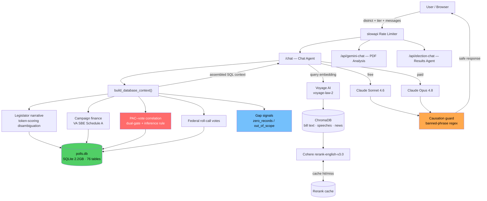

<div align="center">


### Civic Intelligence Platform

**A production AI platform that answers natural-language questions about Virginia government — grounded in 25 years of public records, not language-model guesswork. Every claim is traceable to a public source.**

[](https://voteiq.io)
[](https://www.python.org/)
[](https://fastapi.tiangolo.com/)
[](https://www.sqlite.org/)
[](https://www.trychroma.com/)
[](https://www.anthropic.com/)
[](https://render.com/)

🌐 **[Try it live → voteiq.io](https://voteiq.io)**

</div>

---

## What it is

VoteIQ lets voters, journalists, and civic researchers ask plain-English questions about Virginia government — *"How did my senator vote on HB 123, and who funds them?"* — and get an answer backed by a **verifiable public record**, with a source URL behind every vote, dollar amount, and PAC expenditure.

The hard part isn't calling an LLM. It's guaranteeing the model never invents a vote that didn't happen. VoteIQ solves that with a **SQL-first retrieval architecture**: every answer is assembled from verified database rows *before* the model is invoked. The model synthesizes prose from facts it's handed — it is never the source of the facts. When the database has no record, the system says so instead of guessing.


---

## Why a hiring manager might care

One production system that demonstrates senior-level judgment across the full stack:

- **Retrieval architecture under accuracy constraints** — grounding millions of records so an LLM can't fabricate facts that carry legal and editorial liability for the newsrooms that rely on it.
- **Multi-model orchestration** — routing across Claude (Sonnet/Opus), Gemini, Voyage embeddings, and Cohere rerank, with caching layers that control cost and latency.
- **Safety as architecture, not prompting** — correlation-vs-causation is enforced at *three independent layers*, so the claim "money bought this vote" is structurally impossible to generate, not merely discouraged.
- **Constraint engineering** — the entire stack, `torch` included, runs inside a **512 MB** RAM ceiling. Memory discipline is a design requirement, reflected in how ingestion and index builds are structured.
- **Geospatial foundation** — district resolution via GeoPandas spatial joins against Census TIGER shapefiles, with Folium choropleths over campaign-finance data.

---

## Key capabilities

| | |
|---|---|
| 🔎 **Grounded answers** | Responses assembled from a SQL context block with source URLs *before* the model runs. |
| 🚫 **Refuses to hallucinate** | Explicit `zero_records` / `out_of_scope` gap signals — the system declines rather than fabricating. |
| ⚖️ **Causation-safe by design** | Dual-gate entry + in-context inference rules + an output-time regex guard on generated text. |
| 🗺️ **Geospatial lookups** | Address → district → representative via GeoPandas spatial join, rendered with Folium. |
| 🧠 **Tiered model routing** | Free tier → Sonnet 4.6; paid tiers → Opus 4.8, configurable via environment variables. |
| 📄 **Document analysis** | A separate Gemini-backed route for long-form PDFs such as executive orders. |
| ⚡ **Cost & latency control** | Cohere rerank results and prompt prefixes cached to cut repeat round-trips. |

---

## Architecture



**Request flow:** a query arrives at `/chat` with district + tier metadata → rate limiter → `build_database_context()` runs keyword-gated SQL queries and assembles verified, sourced context blocks (inserting gap signals where data is absent) → Voyage embeds the query, ChromaDB retrieves candidate documents, Cohere reranks them (cache-first) → full context goes to the tier-appropriate model → output passes a causation safety check → a sourced response is returned. The Gemini and election-results paths are fully isolated, with independent context builders.

---

## How grounding works

The model is a **synthesizer, not a source.** Before each response, the context builder hands the LLM verified rows like this:

```text
[Database Context — federal vote lookup]
Source: Congress.gov / House Clerk roll-call tables
target_name=Jennifer A. Kiggans; bioguide_id=K000399
congress_votes summary: congress=119; total_votes=550; yea_votes=409; ...
source_url=https://clerk.house.gov/Votes/2026/0200
```

It does **not** receive *"tell me what you know about Kiggans's record."* If no row matches, the builder injects an explicit gap signal instead of empty context:

```text
[Database Context — va_bills HB999]
lookup_status=zero_records
detail=No record found for HB999 in session 2026.
Do NOT fabricate a vote or outcome for this bill.
```

A newsroom that publishes *"Senator X voted Yes on HB 123"* needs that to be true. An LLM confabulating from approximate embeddings is a liability — so vector search is **supplemental** (bill text, speech excerpts, news) and is never allowed to override a SQL-sourced count, vote, or dollar figure.

---

## The PAC–vote correlation layer

The platform's most carefully engineered component surfaces the relationship between PAC money and voting records **without ever asserting causation** — a claim no public record can support. Three independent defenses:

1. **Dual-gate entry** — the function only runs when the query contains *both* PAC vocabulary *and* vote vocabulary.
2. **In-context inference rule** — every assembled block closes with an explicit instruction that the data shows correlation only.
3. **Output-time guard** — a compiled regex of forbidden causal connectors checks the generated text before it ever reaches the client.

Votes are matched to expenditures through a four-path fallback waterfall (exact name → last-name + chamber → bioguide ID → fuzzy match). The result: *"PAC money bought this vote"* is **structurally impossible to generate**, not just unlikely.

---

## Tech stack

**AI / retrieval** — Anthropic Claude (Sonnet 4.6 / Opus 4.8), Google Gemini 2.5 Flash, Voyage AI (`voyage-law-2`), Cohere Rerank (`rerank-english-v3.0`), ChromaDB
**API** — FastAPI, Gunicorn + Uvicorn (2 workers), Pydantic, SlowAPI rate limiting
**Geospatial** — GeoPandas (spatial joins), Folium (interactive choropleths), Shapely, Geopy / Nominatim
**Data** — SQLite (single 2.2 GB file, no ORM), Census TIGER shapefiles, Render persistent disk
**Infra** — Render Standard, weekly cron ingestion, env-var model pinning, autoDeploy on `main`

---

## Data assets

| Asset | Volume | Source |
|---|---|---|
| Virginia roll-call votes | ~1.3M votes, 25 years | OpenStates / LegiScan, VA SBE |
| Campaign contributions (Schedule A) | 2,212,860 records | Virginia SBE |
| Campaign finance reports | 213,942 records | Virginia SBE |
| Committee testimony | 150,904 records | Legislative proxy data |
| Congressional floor statements | 110,025 records | Congress.gov / House Clerk |
| FEC independent expenditures | Per-cycle | FEC.gov Schedule E |
| Virginia lobbyist registry | Annual | DPOR |
| Legislator civic profiles | 168 pre-generated narratives | Derived from DB |
| Election results | 2018–2025 | Virginia SBE |

---

## Coverage

A 1.8M-voter Hampton Roads coverage area — `Virginia Beach` · `Norfolk` · `Chesapeake` · `Hampton` · `Newport News` · `Suffolk` · `Portsmouth` — over statewide Virginia legislative, finance, and federal-delegation data.

---

## Engineering decisions & tradeoffs

The choices that show the reasoning, not just the result:

- **SQL-first, RAG-supplemental.** More complex retrieval logic in exchange for never confabulating a vote count. Accuracy beats apparent fluency.
- **Explicit decline over silent gaps.** *"I don't know"* feels less impressive than a confident wrong answer — which is exactly why newsrooms trust it.
- **Causation safety in architecture, not a prompt.** A single system-prompt instruction breaks under adversarial rephrasing; three structural layers don't.
- **Single-file SQLite over Postgres.** Data is read-heavy with weekly ingestion, so concurrent writes aren't needed. Gains: zero connection overhead, trivial backup, runs on the cheapest tier with a persistent disk.
- **Memory-bounded ingestion.** Render Standard caps at 512 MB and the stack already loads `torch`, so weekly ingestion runs *inside the web container* via an admin endpoint rather than spawning an OOM-prone subprocess at startup; heavy index/shapefile builds run at build time, not import time.
- **Caching as a first-class concern.** Cohere rerank results are cached in SQLite (keyed by a hash of question + candidates), and demo prefixes use a 1-hour prompt cache — dropping repeat-ask latency from ~90s to ~20–30s.

---

## Deployment

Deployed on **Render Standard** behind 2 Uvicorn workers with a 120s timeout (data-rich Opus responses can take 60–90s). A 2.2 GB SQLite file lives on a persistent disk, seeded once at build time rather than rebuilt per deploy. A weekly cron job ingests fresh congressional data by calling an admin endpoint *inside* the container that owns the disk — cron jobs can't mount disks directly. The DB path is centralized with a loud failure if the disk isn't mounted, preventing silent fallback to a stale local copy.

---

## Local development

```bash
git clone https://github.com/alexisn1989/VoteIQ
cd VoteIQ
pip install -r requirements.txt
uvicorn main:app --reload
```

---

## Roadmap

- [ ] Hampton Roads precinct data
- [ ] State legislative district coverage expansion
- [ ] Expanded donor / PAC correlation views
- [ ] Color-coded precinct choropleths
- [ ] Full Virginia coverage

> **Guiding principle:** *reverse the direction of surveillance* — use AI to make public data accessible to citizens, rather than harvesting personal data from them.

---

## Author

**Alexis** — Python Developer · Civic Tech · GIS

[LinkedIn](https://www.linkedin.com/in/alexis-nieuwenhuys-370465214) · [VoteIQ](https://voteiq.io)
